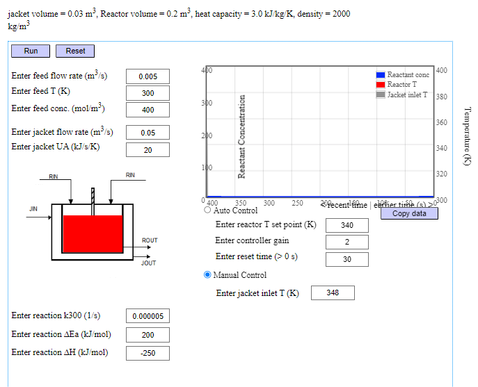
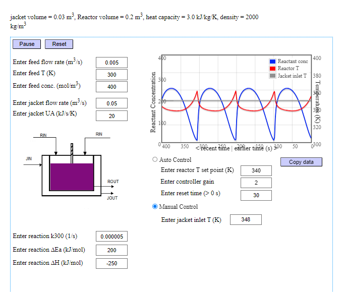
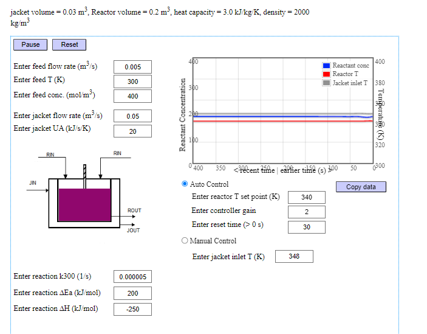
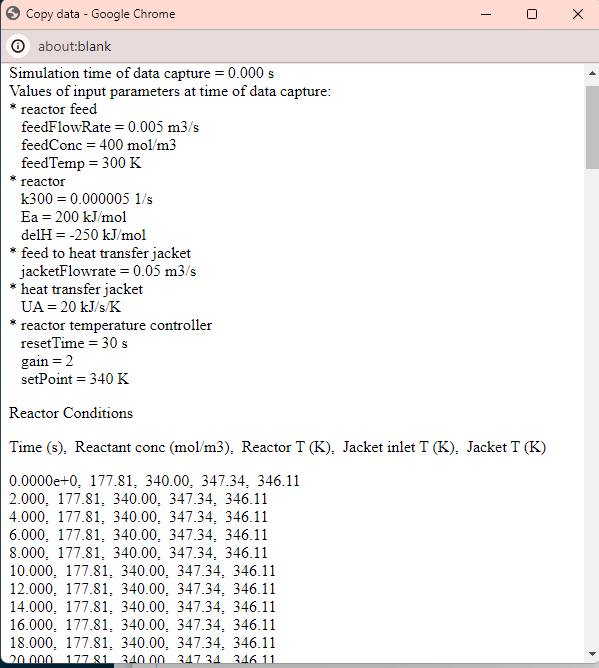

## Procedure

1. Click on the Experiment tab SIMULATON will open the workspace
2. Set the values as you required, the default values are already given.                             
2. To start the simulation , you have to click Run button 
 
3. Click Pause button to pause the simulation  

  

4. Choose between Auto Control or Manual Control (Set as Defaut )  
    
4. Choose between Auto Control or Manual Control (Set as Defaut )                            
                
                            
         
