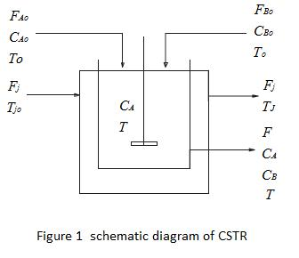

## Introduction

Chemical kinetics and reactor design are at the heart of producing almost all industrial chemicals.The selection of a reaction system that operates in the safest and most efficient manner can be the key to the success or failure of a chemical plant. The reaction occurred in a reactor is exothermic or endothermic.The reactor is generally assembled with a jacket or coil in order to maintain the reaction temperature in the reactor. If heat is evolved due to exothermic reaction, a coolant stream is required to pass through the jacket or coil to remove the extra heat. On the other hand, if endothermic reaction occurs in the system, the flow of heating medium is passing through jacket or coil for maintain the reaction temperature. A reactor operates at a constants temperature, then that is called as the isothermal reactor. If any exothermic or endothermic reactions are involved in the reactor, the temperature of the reactions mixture varies with time and we need to develop the energy balance equation for this non-isothermal reactor. In case of adiabatic reactor no interchange of heat between the system and surroundings. So no heating and cooling medium are required. A chemical reactor is a vessel where reactions are carried out purposefully to produce products from reactants by means of one or more chemical reactions. A chemical reactor may be characterized by the mode operation according to the flow condition. A classification can be made in this respect as follows 
1. Batch reactor 
2. Semi batch reactor 
3. Flow reactors 
&nbsp&nbsp&nbsp&nbsp a. Tubular reactor 
 &nbsp&nbsp&nbsp&nbsp b. Continuous stirred tank reactor
 
 
## Activation Energy
 
 
Activation energy is defined as the minimum energy required starting a chemical reaction. The activation energy of a reaction is denoted by E, and unit is kilojoules per mole. Activation energy can be thought of as the height of the potential barrier (sometimes called the energy barrier) separating two minima of potential energy (of the reactants and products of a reaction). For a chemical reaction to proceed at a reasonable rate, there should exit an appreciable number of molecules with energy equal to or greater than the activation energy.
 
 
## Reaction Rate Constant
 
For many reaction, and particularly elementary reaction, the rate expression can be written as a product of a temperature-dependent term and composition dependent term. <b>`ri=fi(temperature).f2(composition)`</b> For such reactions the temperature-dependent term, the reaction rate constant, has been found in practically all cases to be well represented by Arrhenius's law 
  $$k= \alpha exp(-\frac{E}{RT})$$
 At the same concentration, but at two different temperatures, Arrhenius's law indicates that 
 $$ln (\frac{k_2}{k_1})= \frac{E}{R}(\frac{1}{T_1}-\frac{1}{T_2})$$
 Where, Frequency factor or pre-exponential factor
 E = Activation energy
 R = Universal gas constant.
 

## Heat Of Reaction

Heat of reaction is the amount of heat that must be added or removed during a chemical reaction in order to keep all of the substances present at the same temperature. If the pressure in the vessel containing the reacting system is kept at constant value, the measured heat of reaction also represents the change in the thermodynamic quantity called enthalpy, or heat content, accompanying the process- i.e., the difference between the enthalpy of the substances present at the start of the reaction. Thus, the heat of reaction determined at constant pressure is also designated the enthalpy of reaction, represented by the symbol `Delta H` . If the heat of reaction is positive, the reaction is said to be endothermic and if negative, exothermic.

## Continuous Stirred Tank Reactor Theory

The continuous stirred tank reactor or back mix reactor is a very common processing unit in chemical and polymer industry. Its names suggest, it is a reactor in which the contents are well stirred and uniform throughout. The CSTR is normally run at steady state, and is usually operated so as a to be quite well mixed. The CSTR is generally modeled as having no spatial variations in concentrations, temperature, or reaction rate throughout the vessel. Since the temperature and concentration are identical everywhere within the reaction vessel, they are the same at the exits point as they are elsewhere in the tank.

## Steady State

A situation in which all the state variables remain constant despite parallel processes trying to change them, is referred to as the steady state.

## Time Constant

When we talk about time constant, it's essential to take into account the context in which we are talking about it. In our case, time constant can be defined as 63% of the time that will be taken for a body to reach steady state.

Setup

The following second-order, exothermic chemical reaction takes place in the reactor:
 
</img> Reactant A and B is continuously fed to the reactor with a volumetric flow rate FA0 and FB0, a molar concentration CA , and CB temperature T0. The contents are uniformly mixed by motorized agitator. An exit stream, which contains a mixture of reactant A and B and product C and D, is withdrawn from the reactor continuously with a volumetric flow rate F. The prescribed reaction is exothermic and it is necessary to add a cooling jacket to keep it temperature below 315K. A coolant stream volumetric flow rate Fj and inlet temperature Tj0 continuously takes out the heat to maintain the described reaction temperature.

## Mathematical modeling of continuous stirred tank reactor

 
### Assumptions
 
<li> The mixture density (p) and heat capacity (Cp) are assumed constant.</li>
<li>The reacting mixture is assumed to be well mixed.</li>
<li>The heat losses from the process to the atmosphere are negligible.</li>
 <li>The overall heat transfer coefficient is assumed constant.</li>
 
 
 
### Inputs to the system are

<li>Initial concentration of component A =CA0</li>
 <li>Initial concentration of component B =CB0</li>
<li>Flow rate of A =FA0</li>
 <li>Flow rate of B =FB0</li>
<li>Jacket flow rate =Fj</li>
 <li>Feed temperature =T0</li>
 <li>Jacket temperature =Tj0</li>
 
 
## Component continuity equation

The component balance equation is 
 
$$
\left[\begin{array}{cc} 
Rate \ of \ accumulation \\
within \ the \ system 
\end{array}\right] =
\left[\begin{array}{cc} 
Rate \ of \ flow \\
into \ the \ system
\end{array}\right]-
\left[\begin{array}{cc} 
Rate \ of \ flow\\
out \ of \ the \ system 
\end{array}\right]+
\left[\begin{array}{cc} 
Rate \ of \ generation \ by \ chemical \\
reaction \ within \ the \ system 
\end{array}\right]
$$

## For component A (Reactant)

 
Flow rate of component A into the reactor = FA0 Flow rate of component Aout of the reactor = FCA 
 Rate of generation of component A by chemical reaction = -(-rA)V 
$$Rate \ of \ accumulation \ of \ component \ A \ within \ the \ reactor \ = d \frac{(VC_A)}{dt}$$
 Here, (-rA) is the rate of disappearance of species A. V is the volume of the reactor. From equation (1), we obtain 
$$d \frac{(VC_A)}{dt}=F_{A0}C_{A0}-FC_A-(-r_A)V$$  
$$\frac{dC_A}{dt}=\frac{(F_{A0}C_{A0}-FC_A)}{V}-(-r_A)$$
For the given second order reaction, the rate of disappearance is 
$$(-r_A)=k(C_AC_B-\frac{C_CC_D}{K_C})$$
$$k=39178exp[5472.7(\frac{1}{273}-\frac{1}{T}]$$
$$K_c=exp(\frac{1698}{T})$$
Substituting Equation (7) and (8) into equation (6), then we get
$$(-r_A)=3918exp[5472.7( \frac{1}{273}-{1}{T})]-(C_AC_B- \frac{C_CC_D}{exp(\frac{1698}{T})})$$
  
Substituting Equation (9) into equation (5), then we get 
$$\frac{dC_A}{dt}=\frac{(F_{A0}C_{A0}-FC_A)}{V}-3918exp[5472.7(\frac{1}{273}-\frac{1}{T})]-(C_AC_B-\frac{C_CC_D}{exp(\frac{1698}{T})})$$
## For component B (Reactant)

Flow rate of component B into the reactor =FB0CB0 
Flow rate of component B out of the reactor =FCB 
Rate of generation of component B by chemical reaction = (-rB)V 
$$Rate \ of \ accumulation \ of \ component \ A \ within \ the \ reactor =\frac{d(VC_B)}{dt}$$
Here,(-rB) is the rate of disappearance of species B and (-rA)=(-rB) 
From equation (1), we obtain 
$$\frac{d(VC_B)}{dt}=F_{B0}C_{B0}-FC_B-(-r_A)V$$
$$\frac{dC_B}{dt}=(F_{B0}C_{B0}-FC_B)V-(-r_A)$$
Substituting Equation (7) into equation (12), then we get 
$$\frac{(dC_B}{dt}=\frac{(F_{B0}C_{B0}-FC_B)}{V}-3918exp[5472.7(\frac{1}{273}-\frac{1}{T})]-(C_AC_B-\frac{C_CC_D}{exp(\frac{1698}{T})})$$

For component C (Product)

Flow rate of component C into the reactor = 0 
Flow rate of component C out of the reactor = FCC 
Rate of generation of component C by chemical reaction = (rc)V 
$$Rate \ of \ accumulation \ of \ component \ C \ within \ the \ reactor = \frac{d(VC_C)}{dt}$$
Here, 
 -(-rA)=(rc) 
 From equation (1), we obtain 
 $$\frac{d(VC_C)}{dt}=-FC_C+(-r_A)V$$
$$\frac{dC_C}{dt}=\frac{(-FC_C)}{V}+(-r_A)$$
  Substituting Equation (7) into equation (13), then we get
$$\frac{dC_C}{dt}=\frac{(-FC_C)}{V}+39178exp[5472.7(\frac{1}{273}-\frac{1}{T}]-(C_AC_B-\frac{C_CC_D}{exp(\frac{1698}{T})})$$

Energy Balance Equation

The energy balance equation is  `[["Rate of energy"],["accumulation"]]=[["Rate of energy input"],["into the system"]]-[["Rate of energy"],["out of the system"]]+[["Rate of energy added by"],["exothermic chemical reaction"]]`

 
Reactor analysis

$$Rate \ of \ energy \ input \ into \ the \ reactor = F_\rho C_pT_0$$
$$Rate \ of \ energy \ out \ of \ the \ reactor =F_\rho C_pT+UA(T-T_j)$$
$$Rate \ of \ energy \ added \ by \ the \ exothermic \ reaction =(-\Delta H)V(-r_A)$$
$$Rate of accumulation of energy = \frac{d(V_rhoC_PT)}{dt}$$
$$(-\Delta H) \ is \ the \ heat \ of \ reaction.$$
From equation (20), we obtain 
$$\frac{d(V_\rho C_PT)}{dt}=F_rhoC_pT_0-UA(T-T_j)+(-\Delta H)V(-r_A)$$

Simplifying this equation, we get 
$$\frac{dT}{dt}=\frac{F}{V}(T_0-T)-\frac{\Delta H(-r_A)}{\rho C_P}-\frac{UA(T-T_j)}{V_\rho C_P}$$
Substituting Equation (7) into equation (22), then we get 
$$\frac{dT}{dt}=\frac{F}{V}(T_0-T)-\frac{(\Delta H)39178exp[5472.7(1/273-1/T)]-(C_AC_B-\frac{C_CC_D}{exp(\frac{1698}{T})})}{(\rho C_P)}-\frac{UA(T-T_j)}{V_\rho C_P}$$

Jacket Analysis

$$Rate \ of \ energy \ input \ into \ the \ jacket =F_j \rho_jC_pjT_j0$$
$$Rate \ of \ energy \ out \ of \ the \ reactor = F_j \rho_jC_pjT_j-UA(T-T_j)$$
$$Rate \ of \ accumulation \ of \ energy =\frac{d(V_j \rho_jC_pjT_j)}{dt}$$
Vj is the volume of the jacket.
  From energy balance equation, we get 
$$\frac{d(V_j \rho_jC_pjT_j)}{dt}=F_j \rho_jC_pjT_j0-F_jrho_jC_pjT_j+UA(T-T_j)$$
$$\frac{dT_j}{dt}=\frac{F_j}{V_j}(T_j0-T_j)+\frac{UA(T-T_j))}{V_j \rho_jC_pj}$$

Input Parameter

8.	Initial concentration of component A = CA0 
9.	Initial concentration of component B = CB0 
10.	Flow rate of A = FA0 
11.	Flow rate of B = FB0 
12.	Jacket flow rate = Fj 
13.	Feed temperature =T0 
14.	Jacket temperature = Tj0

     
 
